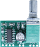

# Fritzing

## Projects

### [GF1002 Stereo Amplifier](./GF1002_StereoAmplifier) - A Fritzing part

PAM8403 mini 5V digital amplifier board with switch potentiometer.

## License

All files are released under creative commons license 4.0:

[Attribution-ShareAlike CC BY-SA](http://creativecommons.org/licenses/by-sa/4.0/)

The software is furnished "as is", without technical support, and with no warranty, express or implied, as to its usefulness for any purpose.
